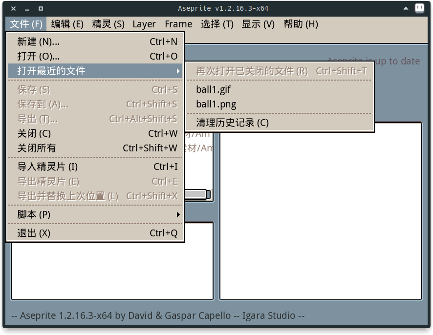
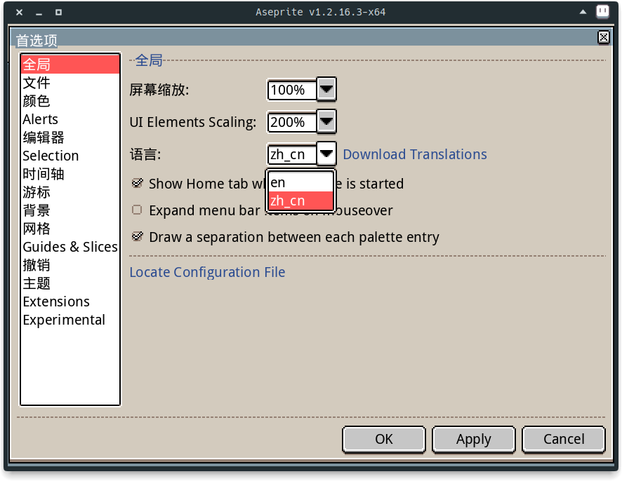

# Aseprite-Chinese-Translate

## 汉化效果



## 汉化方式

下载本项目

```sh
git clone https://github.com/tofuHero/Aseprite-Chinese-Translate.git
```

### 汉化

1. 复制 `Aseprite-Chinese-Translate/data/strings/zh_cn.ini` 到 Aseprite 安装目录下的 `data/strings/` 文件夹里

2. 启动 Aseprite，设置程序语言为 `zh_cn`

   

### 修改字体（可选）

1. 备份源文件

   复制 Aseprite 安装目录下的 `data/fonts/fonts.xml` 为 `data/fonts/fonts.xml.bak`

2. 复制 `Aseprite-Chinese-Translate/data/fonts` 文件夹到 Aseprite 安装目录下的 `data/fonts`

3. 重启 Aseprite 即可